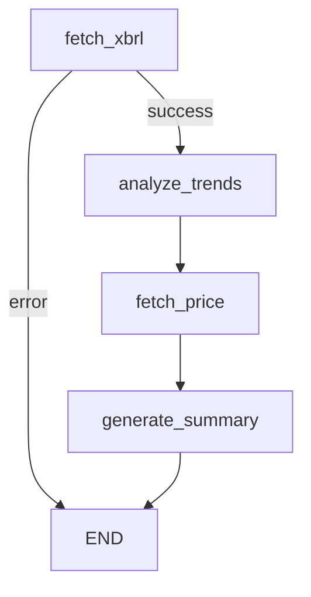

# 🤖 AI Investment Analysis Agent

## Overview

The AI Investment Analysis Agent is a Python-based service that provides automated investment analysis using SEC 10-Q filings and LLM-powered insights. It's designed for **minimal token usage** (~500 tokens per analysis) by extracting structured data programmatically.

## Architecture

```
┌─────────────────────────────────────────────────────────────┐
│                   FastAPI Server (port 8000)                 │
├─────────────────────────────────────────────────────────────┤
│                                                              │
│  ┌────────────┐   ┌────────────┐   ┌────────────┐          │
│  │ fetch_xbrl │ → │  analyze   │ → │   fetch    │          │
│  │   (SEC)    │   │   trends   │   │   price    │          │
│  └────────────┘   └────────────┘   └────────────┘          │
│         │                │                │                  │
│         └────────────────┴────────────────┘                  │
│                         │                                    │
│                         ▼                                    │
│              ┌────────────────────┐                          │
│              │ generate_summary   │                          │
│              │   (Google Gemini)  │                          │
│              └────────────────────┘                          │
│                                                              │
└─────────────────────────────────────────────────────────────┘
```

## Technology Stack

| Technology | Version | Purpose |
|------------|---------|---------|
| Python | 3.11+ | Runtime |
| FastAPI | latest | Async REST API |
| LangGraph | latest | Workflow orchestration |
| LangChain Google GenAI | latest | Gemini LLM integration |
| Pydantic | v2 | Data validation |
| httpx | latest | Async HTTP for SEC API |

## LangGraph Workflow

The agent uses a 4-node workflow with conditional error handling:



### Nodes

| Node | LLM Tokens | Description |
|------|------------|-------------|
| `fetch_xbrl` | 0 | Fetches XBRL data from SEC EDGAR API |
| `analyze_trends` | 0 | Calculates revenue/margin/EPS trends |
| `fetch_price` | 0 | Gets current price from Giraffe API |
| `generate_summary` | ~500 | Generates investment summary via Gemini |

**Total: ~500 tokens per analysis** (~$0.001 with Gemini Flash)

---

## Directory Structure

```
agent/
├── main.py                  # FastAPI entry point
├── requirements.txt         # Python dependencies
├── .env.example            # Environment template
└── agent/
    ├── __init__.py
    ├── graph.py             # LangGraph workflow
    ├── models.py            # Pydantic data models
    ├── prompts.py           # LLM prompts (minimal)
    └── tools/
        ├── __init__.py
        ├── xbrl_extractor.py   # SEC XBRL API parser
        └── price_fetcher.py    # Giraffe Terminal API client
```

---

## API Endpoints

### `GET /health`
Health check endpoint.

**Response:** `{"status": "healthy"}`

### `POST /analyze/{ticker}`
Analyze a stock using SEC 10-Q filings.

**Parameters:**
- `ticker` (path) - Stock ticker symbol (e.g., "AAPL")

**Request Body (optional):**
```json
{
  "num_quarters": 3,
  "include_current_price": true
}
```

**Response:**
```json
{
  "ticker": "AAPL",
  "company_name": "Apple Inc.",
  "cik": "320193",
  "current_price": 195.50,
  "analysis_date": "2024-12-28",
  "quarterly_metrics": [
    {
      "period_end": "2024-09-28",
      "fiscal_period": "Q4",
      "revenue": 94930000000,
      "net_income": 14736000000,
      "eps_diluted": 0.97,
      "gross_margin": 0.462
    }
  ],
  "trend_analysis": {
    "revenue_trend": "growing",
    "avg_revenue_growth_yoy": 0.05,
    "margin_trend": "stable"
  },
  "investment_summary": "Apple shows consistent 5-6% YoY revenue growth..."
}
```

---

## Data Models

### QuarterlyMetrics
Financial metrics for a single quarter from 10-Q filing.

| Field | Type | Description |
|-------|------|-------------|
| `period_end` | string | Quarter end date |
| `fiscal_period` | string | Q1, Q2, Q3, Q4 |
| `revenue` | float | Total revenue |
| `net_income` | float | Net income |
| `eps_diluted` | float | Diluted EPS |
| `gross_margin` | float | Gross profit margin |
| `operating_margin` | float | Operating margin |

### TrendAnalysis
Trend analysis across multiple quarters.

| Field | Type | Description |
|-------|------|-------------|
| `revenue_trend` | string | "growing", "declining", "stable" |
| `avg_revenue_growth_yoy` | float | Average YoY growth rate |
| `margin_trend` | string | Margin direction |
| `eps_trend` | string | EPS direction |

---

## Tools

### XBRL Extractor (`xbrl_extractor.py`)
Fetches structured financial data from SEC's XBRL API.

**Key Functions:**
- `extract_quarterly_metrics(ticker, num_quarters)` - Extracts financial metrics
- `calculate_trends(metrics_list)` - Computes trend analysis

**Data Sources:**
- SEC Company Facts API: `https://data.sec.gov/api/xbrl/companyfacts/CIK{cik}.json`
- SEC CIK Mapping: `https://www.sec.gov/files/company_tickers.json`

### Price Fetcher (`price_fetcher.py`)
Gets current stock price from Giraffe Terminal backend.

**Key Functions:**
- `get_current_price(ticker)` - Fetches price from localhost:3001

---

## Configuration

### Environment Variables

| Variable | Description | Default |
|----------|-------------|---------|
| `GOOGLE_API_KEY` | Google AI API key (required) | - |
| `LLM_MODEL` | Gemini model to use | `gemini-2.0-flash` |
| `GIRAFFE_API_URL` | Giraffe Terminal API URL | `http://localhost:3001` |

### Running the Server

```bash
cd agent
python -m venv venv
venv\Scripts\activate  # Windows
pip install -r requirements.txt
python main.py
```

Server runs at `http://localhost:8000`

---

## Limitations

- **SEC filings only** - Only works with US public companies that file 10-Q reports
- **No ETFs** - ETFs (SPY, QQQ) don't file 10-Q reports
- **Quarterly data** - Limited to most recent 10-Q filings
- **Price dependency** - Requires Giraffe Terminal backend for current prices
